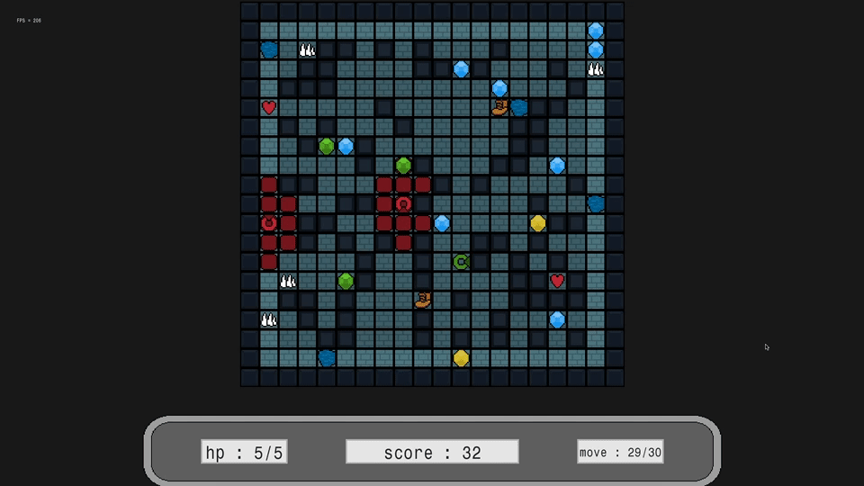

# time_wrapper

This is a quick project made with my library, to help me create it.

In this game, you have multiple objects on the ground. After 30 mouvements from you, one ghost will appread, and once more every 30 steps.
The goal of the game is to reach gem on the board, to gain point, without been seen by the ghost (the ghost vision is represented by the red mark on the floor).

